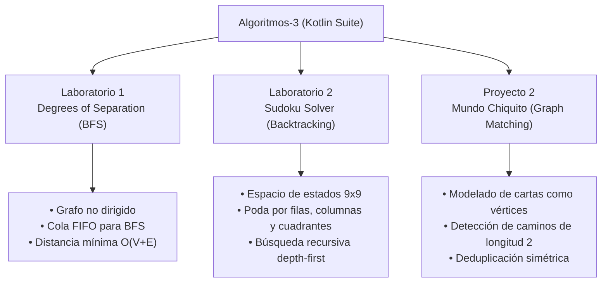

<div align="center">

# 🧠 Algoritmos & Estructuras de Datos Avanzadas en Kotlin

**Suite de implementaciones algorítmicas de alto rendimiento: Grafos, Recorridos BFS, Backtracking con Poda y Búsqueda Combinatoria.**

Desarrollado para **CI-2693: Algoritmos y Estructuras de Datos III** en la [Universidad Simón Bolívar (USB)](https://www.usb.ve/).

[](https://kotlinlang.org/)
[](https://openjdk.org/)
[](#módulos-y-laboratorios)
[](#autor)

</div>

---

## 📌 Descripción General

Este repositorio reúne las soluciones de ingeniería algorítmica desarrolladas a lo largo de la cátedra de Algoritmos y Estructuras III en la USB. Cada módulo aborda problemas clásicos y combinatorios complejos, priorizando el diseño modular en **Kotlin**, el análisis formal de complejidad temporal y espacial ($\mathcal{O}$), y el manejo eficiente de la memoria en la JVM.

---

## 📁 Módulos y Proyectos



---

### 🌐 1. Laboratorio 1 — Grados de Separación (BFS)
- **Problema:** Encontrar la menor distancia de separación entre dos nodos en una red social modelada como un grafo no dirigido.
- **Técnica:** Recorrido en anchura (**Breadth-First Search - BFS**) utilizando una cola `ArrayDeque` y un conjunto de visitados para garantizar el camino más corto en grafos no ponderados.
- **Complejidad:** $\mathcal{O}(V + E)$ en tiempo y $\mathcal{O}(V)$ en espacio.

### 🧩 2. Laboratorio 2 — Solucionador de Sudoku (Backtracking con Poda)
- **Problema:** Resolver tableros de Sudoku de $9 \times 9$ con restricciones de no repetición en filas, columnas y subcuadrículas de $3 \times 3$.
- **Técnica:** Algoritmo de **Backtracking** recursivo con poda anticipada del espacio de búsqueda. Si una asignación viola las restricciones del juego, la rama se descarta inmediatamente, evitando la explosión combinatoria.
- **Complejidad:** En el peor caso $\mathcal{O}(9^{m})$ (donde $m$ es el número de casillas vacías), optimizado drásticamente en la práctica gracias a las reglas de consistencia de estados.

### 🃏 3. Proyecto 2 — Mundo Chiquito (Combinatoria de Grafos)
- **Problema:** Búsqueda exhaustiva de ternas válidas de cartas $(A, B, C)$ que funcionen como "puentes" compartiendo estrictamente una característica común entre pares consecutivos.
- **Técnica:** Construcción de grafos de similitud por listas de adyacencia y búsqueda de caminos simples de longitud 2 con filtrado simétrico de índices ($i < k$).

---

## 🛠️ Compilación y Ejecución

### Prerrequisitos
- JDK 11 o superior instalado.
- Compilador de Kotlin (`kotlinc`) configurado en el PATH.

### Compilar y Ejecutar Laboratorios
```bash
# Navegar al laboratorio deseado (ej. Lab 1)
cd Laboratorios/Lab1

# Compilar
kotlinc *.kt -include-runtime -d Lab1.jar

# Ejecutar
java -jar Lab1.jar
```

---

## 👤 Autor
**Victor Hernández**  
- Estudiante de Ingeniería de Computación @ [Universidad Simón Bolívar (USB)](https://www.usb.ve/)
- GitHub: [@soyvistorrr](https://github.com/soyvistorrr)
- LinkedIn: [Victor Hernández](https://linkedin.com/in/soyvistorr3009)
- Email: victormhernandeza3009@gmail.com
